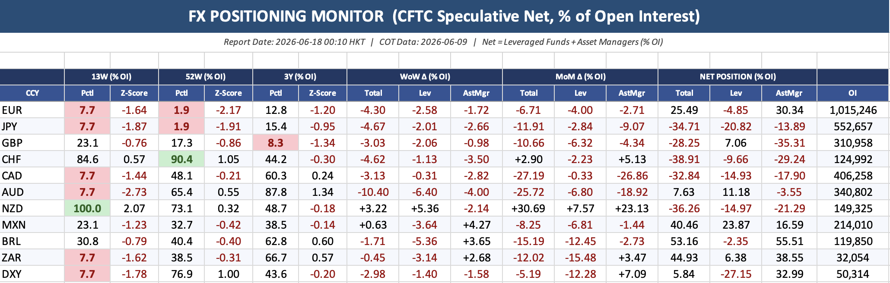
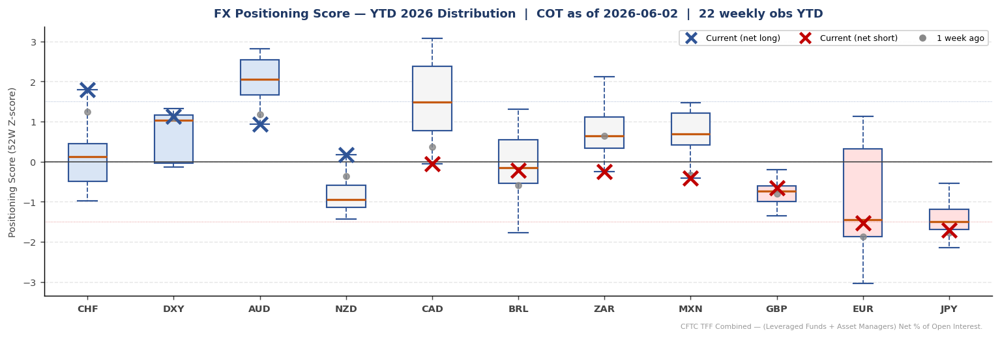
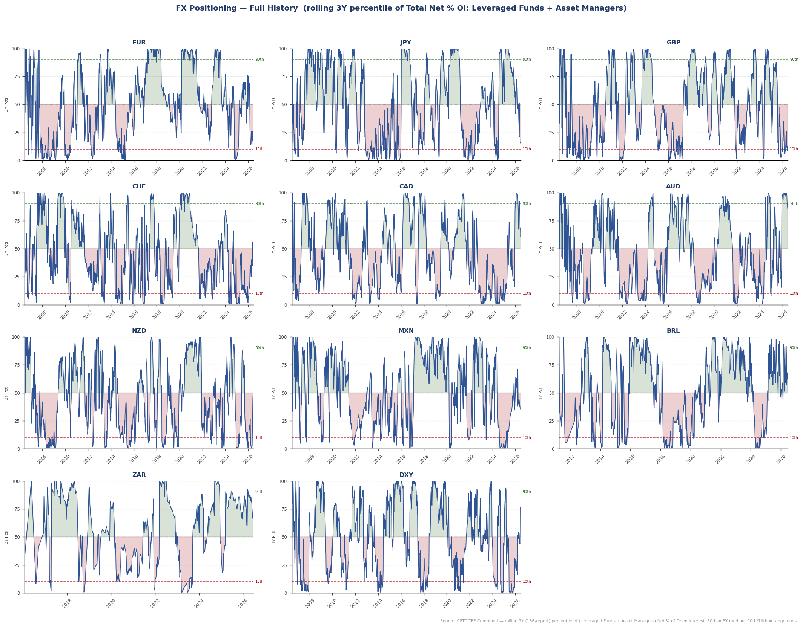
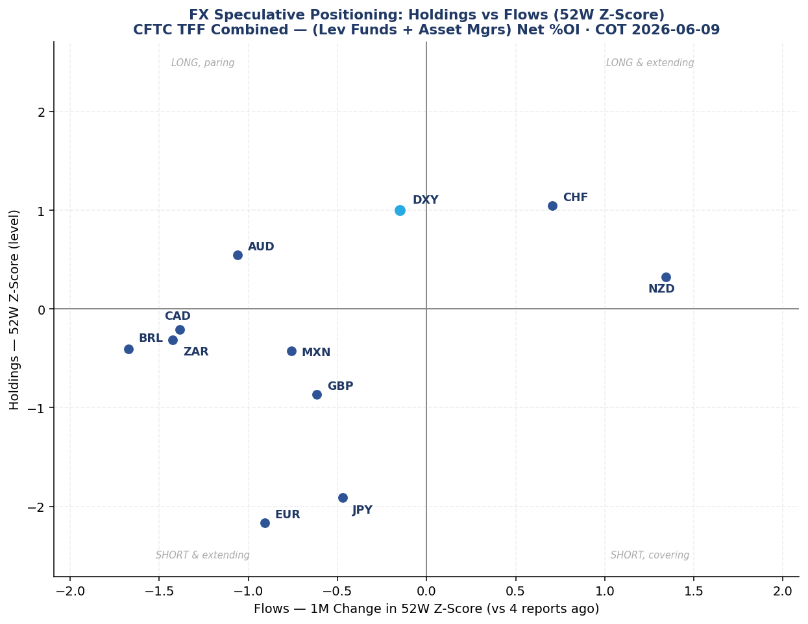

# fx-positioning-skill

An **[Agent Skill](https://www.anthropic.com/news/skills)** — works in
[Claude Code](https://claude.com/claude-code), Cursor, OpenAI Codex, and other
`SKILL.md`-compatible agents — that turns live CFTC positioning data into a
sell-side-style FX positioning note for traders.

When invoked, it:

1. Runs a self-contained Python pipeline that pulls **CFTC TFF
   (Traders in Financial Futures), Futures+Options Combined** data from the
   CFTC Socrata API for 11 markets — **EUR, JPY, GBP, CHF, CAD, AUD, NZD, MXN,
   BRL, ZAR, DXY** — and computes **Leveraged-Funds + Asset-Manager net
   positioning as a % of open interest**, with 13-week, 52-week and 3-year
   percentiles and z-scores (tactical → cyclical → structural), and WoW & MoM changes.
2. Produces a formatted Excel workbook, three charts (a YTD positioning-score
   distribution, a full-history time series on a **rolling 3-year percentile**
   y-axis, and a supplementary level-vs-momentum scatter), and a
   machine-readable CSV.
3. Has the agent read the table and **view the charts**, then write a one-page
   positioning note in the house style of the JPM FX Positioning Monitor /
   Morgan Stanley G10 FX positioning reports.
4. Renders that note into a styled, one-page **PDF** (the deliverable the PM
   opens) via the bundled `scripts/md_to_pdf.py`.

The note is **descriptive, not advisory** — it tells you where the market is
positioned (levels, range position, cohort splits, flows), and leaves the
trade and the macro narrative to you. It is **strictly data-only**: no external
macro/carry/event commentary is invented.

## Example output

The Excel workbook (`Positioning_Data.xlsx`) — the formatted table with
crowding highlights (green = crowded long, red = crowded short):



The charts the analysis reads (also embedded in the workbook):

| YTD positioning-score distribution | Rolling 3Y percentile of net positioning |
|---|---|
|  |  |

Plus a supplementary **level-vs-momentum** scatter — y = current 52W z-score
(how stretched on the year), x = the 1-month change in that z-score (which way
the book is moving), one dot per currency; quadrants read as long/short ×
adding/paring:



And the written note Claude produces from them: see
[`examples/sample_note.md`](examples/sample_note.md).

## Install

This is a standard [Agent Skill](https://www.anthropic.com/news/skills) — a
`SKILL.md` (YAML `name`/`description` + instructions) plus a bundled Python
script and reference doc. The format is supported by Claude Code and adopted by
other agent tools (Cursor, OpenAI Codex, and any host that loads `SKILL.md`
skills), so the same repo works across all of them. The pipeline and writing
style are plain Python + Markdown — nothing is Claude-specific.

Clone it into your tool's skills directory. **Keep the folder named
`fx-positioning`** — it must match the `name:` in `SKILL.md`.

```bash
# Claude Code
git clone https://github.com/ddddyfmarket-sys/fx-positioning-skill.git \
  ~/.claude/skills/fx-positioning

# Cursor
git clone https://github.com/ddddyfmarket-sys/fx-positioning-skill.git \
  ~/.cursor/skills-cursor/fx-positioning

# OpenAI Codex  (CODEX_HOME defaults to ~/.codex)
git clone https://github.com/ddddyfmarket-sys/fx-positioning-skill.git \
  "${CODEX_HOME:-$HOME/.codex}/skills/fx-positioning"

# Any other agent: clone into wherever your host loads skills from.
```

Then install the Python dependencies (from inside the cloned folder):

```bash
pip install -r requirements.txt
```

Restart your agent session so it picks up the new skill (in Claude Code,
confirm with `/skills`).

### Requirements

- **Python 3** with the packages in `requirements.txt`.
- A host/agent that can **run shell commands and read files**. Image input is
  recommended (so the agent can view the charts), but optional — without
  it the skill falls back to the CSV, whose percentile/z-score columns capture
  most of what the charts show.

## Usage

In any agent that has the skill installed, just ask for a positioning read,
e.g.:

- *"Give me an FX positioning update."*
- *"What's the CFTC/COT data saying on G10 and EM?"*
- *"Run the FX positioning monitor."*

The agent runs the pipeline and writes the note into your current working
directory alongside the data outputs.

You can also run the pipeline directly (point Python at wherever you cloned the
skill; outputs go to the current directory):

```bash
SKILL_DIR=~/.claude/skills/fx-positioning   # or ~/.cursor/skills-cursor/fx-positioning, etc.
python3 "$SKILL_DIR/scripts/fx_positioning.py"            # outputs to CWD
python3 "$SKILL_DIR/scripts/fx_positioning.py" --outdir . # explicit dir
python3 "$SKILL_DIR/scripts/fx_positioning.py" --refresh  # bypass 24h cache
```

### Outputs

| File | What it is |
|---|---|
| `positioning_table.csv` | The table incl. the Leveraged-Funds vs Asset-Manager split — the source of truth for every number in the note. |
| `ytd_positioning.png` | YTD distribution of each currency's 52W positioning score, with current (×) and 1-week-ago (•) marked. |
| `history_positioning.png` | Full-history small multiples per currency: y-axis = **rolling 3Y (trailing 156-report) percentile** of Total Net % OI (0–100), with 90th/10th range-end bands and the 50th-percentile median — how stretched each point was vs its prior 3 years. |
| `momentum_positioning.png` | Supplementary level-vs-momentum scatter: y = current 52W z-score, x = 1-month change in that z-score, one dot per currency; quadrants = long/short × adding/paring. |
| `Positioning_Data.xlsx` | Formatted table + all three charts embedded. |
| `fx_positioning_note_<date>.md` / `.pdf` | The written note and its styled one-page PDF (produced by `scripts/md_to_pdf.py`). |

The CFTC API response is cached locally (`~/.fx_cache/`) for 24h, so repeated
runs are fast and don't re-hit the API.

To render an existing note to PDF directly:

```bash
python3 "$SKILL_DIR/scripts/md_to_pdf.py" fx_positioning_note_<date>.md
```

It converts Markdown → styled HTML → PDF, preferring headless Chrome and
falling back to weasyprint / wkhtmltopdf.

## Repository layout

```
SKILL.md                  the skill definition (workflow + metric interpretation)
scripts/fx_positioning.py the CFTC pipeline
scripts/md_to_pdf.py      renders the written note (.md) into a styled PDF
references/writing_style.md the house writing style the analysis follows
examples/                 a sample note + charts
requirements.txt          Python dependencies
```

## Methodology

- **Net % OI** = (Leveraged Funds net + Asset Managers net) / Open Interest × 100,
  using CFTC TFF Futures+Options Combined.
- **Percentile** = where the latest Total Net % OI sits within a lookback
  window (crowding / range position).
- **Z-score** = standard deviations of the latest reading from the mean of that
  window (extension).
- **Lookback windows:** 13W ≈ tactical/recent · 52W ≈ cyclical (1Y) · 3Y ≈
  structural/multi-year (156 reports) · plus full-history `Hist Z` / `Hist Pctl`
  (full sample, the all-time-extreme read). The history chart's y-axis is the
  **rolling 3Y percentile**, so its endpoint equals the `3Y Pctl` column — a
  point-in-time read of how stretched positioning is vs its own recent 3 years.
  The windows can diverge — a position can be at its 13W floor yet near its 3Y
  high.

## Disclaimer

This tool summarizes publicly available CFTC positioning data. It is not
investment advice and produces no trade recommendations. Data is sourced from
the CFTC

## License

[MIT](LICENSE).
